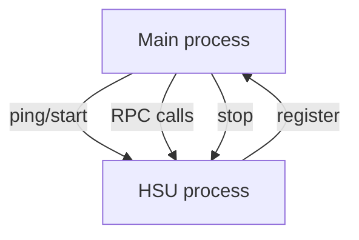

# HSU Microservice Architecture

## Overview

The **Host System Unit (HSU)** architecture provides a clean, pluggable way to compose a larger application out of independent, language‑agnostic micro‑services.  Each HSU implements one or more **gRPC interfaces** that the main process (client) consumes through a stack of generated gRPC stubs.

- **Main process** – a long‑running process (written in Go by default) that includes lightweight *client* modules for every registered interface.
- **HSU** – an on‑demand worker process that *implements* one or more of those interfaces.  HSUs can be written in **any** language that speaks gRPC.

This design lets you:

- Spin HSUs up and down dynamically to save CPU/RAM.
- Mix implementations (Go, Python, Rust …) without rewriting the client.
- Add new features by dropping in a new `.proto` and rebuilding the client SDK.

---

## Architecture Diagram


---

## Core Concepts

| Concept                  | Description                                                                       |
| ------------------------ | --------------------------------------------------------------------------------- |
| **HSU Core Interface**   | Mandatory service for health‑check, start/stop, ping, log streaming, etc.         |
| **Interface A / B …**    | Optional feature‑specific APIs (e.g. LLM management, RAG indexer, video encoder). |
| **gRPC Interface Stack** | Collection of generated client stubs that the main process links against.         |
| **HSU Process**          | A standalone executable that registers one or more interfaces over gRPC.          |
| **Dynamic Lifecycle**    | Main process starts/stops HSUs on demand to conserve resources.                   |

### Typical Use‑Cases

- **LLM Management** – start/stop model servers, run inference or embeddings
- **LLM Benchmark** – enumerate benchmarks, execute, gather results
- **RAG Components** – ingest documents, store vectors, query retrieval
- **Storage Adapters** – object store CRUD wrappers
- **Video Encoding** – transcode jobs in parallel workers
- **LLM Training Workers** – distributed fine‑tuning jobs
- **Real‑Time Stream Analytics** – stateless/stateful processors for Kafka/Kinesis topics
- **Notification Dispatchers** – email/SMS/push gateways with pluggable providers

## Repository Layout (suggested)

```
.
├── cmd/                  # Main + sample HSUs
├── proto/                # gRPC contract files
│   ├── hsu_core.proto    # Core API (required)
│   ├── hsu_a.proto       # Feature A API (optional)
│   └── hsu_b.proto       # Feature B API (optional)
├── internal/             # Shared client/server helpers
└── docs/                 # Specs & diagrams
```

---

## Quick Start (demo)

```bash
# 1. Generate Go client stubs (example language)
make gen-go

# 2. Build example HSUs
make build‑example

# 3. Run the main process (will auto‑spawn HSUs on demand)
./bin/main
```

---

## Defining a New Interface

1. Drop a new proto in ``.
2. Run `make gen‑all` to regenerate stubs for every target language.
3. Implement an HSU that registers `hsu_xyz`.
4. Add the new client stub to the main process dependency list.

### 📄 Placeholder – gRPC Proto Definition

```proto
// proto/hsu_xyz.proto
syntax = "proto3";
package hsu.xyz;

// TODO: replace with real service definition
service XYZ {
    rpc DoSomething (XYZRequest) returns (XYZResponse);
}
```

---

## Implementing an HSU

### Go Example (implements Core + A)

```go
// cmd/hsu_a_service1/main.go
// TODO: full implementation
func main() {
    // 1. Parse flags & config
    // 2. Register Core and Interface A servers
    // 3. Serve gRPC
}
```

### Python Example (implements Core + B)

```python
# cmd/hsu_b_service1/main.py
# TODO: full implementation
async def serve():
    # 1. Instantiate Core & B servicers
    # 2. Start aio gRPC server
```

### Rust Example (implements Core, A & B)

```rust
// cmd/hsu_abc_service/src/main.rs
// TODO: full implementation using tonic
#[tokio::main]
async fn main() -> Result<(), Box<dyn std::error::Error>> {
    // register services and serve
}
```

---

## Runtime Lifecycle



1. **Discovery** – main process checks if an HSU is running, or spawns it.
2. **Handshake** – HSU registers active interfaces via Core API.
3. **Workload** – main invokes RPCs.
4. **Shutdown** – idle HSUs are stopped to free resources.

---

## Extending the System

- **Add a language** – run that language’s gRPC code‑gen tool for all `.proto` files.
- **Swap an implementation** – stop current HSU binary, launch alternative.
- **Compose** – an HSU can expose *multiple* interfaces in one process to save IPC.

---

## Contributing

1. Fork → feature branch → PR.
2. Run `make lint test` before opening a pull request.
3. Describe which interfaces your code changes touch.

---

## License

Apache-2.0
