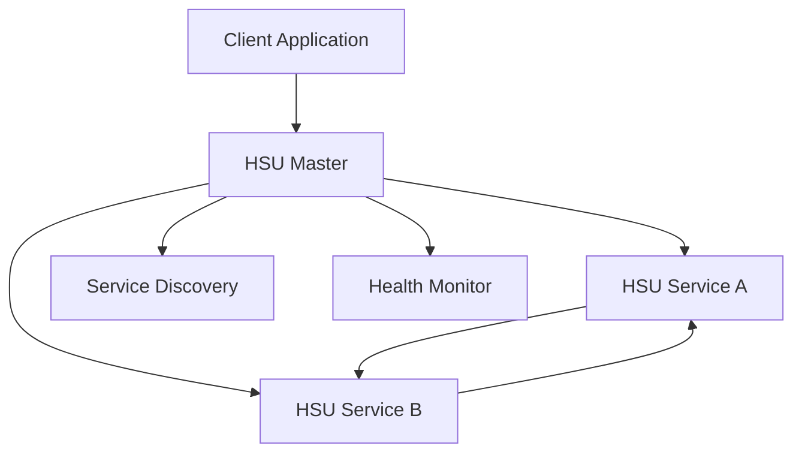

# HSU Platform System Architecture

**Date**: January 2, 2025  
**Version**: 1.0  
**Status**: Production Ready

## 🏗️ **System Overview**

The HSU platform implements a **distributed master-worker architecture** optimized for **repository portability** and **multi-language integration**. The system enables seamless service development across different repository structures while maintaining consistent build, deployment, and operational patterns.


## 🔧 **Core Components**

### **1. Master Process**
The central coordination and management component that orchestrates the entire HSU ecosystem.

#### **Responsibilities**
- **Service Discovery** - Locates and registers HSU services
- **Process Lifecycle Management** - Starts, stops, monitors, and restarts services
- **API Gateway Functions** - Routes requests to appropriate services
- **Health Monitoring** - Continuous health checks and failure detection
- **Load Balancing** - Distributes requests across service instances
- **Centralized Logging** - Aggregates logs from all services

#### **Technical Implementation**
```go
type HSUMaster struct {
    serviceRegistry  *ServiceRegistry
    processManager   *ProcessManager
    healthMonitor    *HealthMonitor
    loadBalancer     *LoadBalancer
    apiGateway       *APIGateway
}
```

#### **Key Features**
- **Auto-discovery** - Services automatically register on startup
- **Failure recovery** - Automatic restart of failed services
- **Dynamic scaling** - Add/remove service instances based on load
- **Protocol routing** - Route gRPC requests to appropriate services
- **Observability** - Centralized metrics and monitoring

### **2. Host System Units (HSUs)**
Individual microservices that implement business logic while integrating with the HSU platform infrastructure.

#### **Core HSU Integration**
Every HSU includes standard platform integration:

```go
// Core HSU interface (Go)
type HSUService interface {
    // Platform integration
    Ping(context.Context) error
    GetHealth() HealthStatus
    Shutdown() error
    
    // Service-specific methods
    // (defined by individual HSU)
}
```

```python
# Core HSU interface (Python)
class HSUService:
    def ping(self) -> bool:
        """Health check endpoint"""
    
    def get_health(self) -> HealthStatus:
        """Detailed health information"""
    
    def shutdown(self):
        """Graceful shutdown"""
    
    # Service-specific methods
    # (defined by individual HSU)
```

#### **Business Logic Services**
HSUs implement domain-specific functionality:

- **Pure business logic** - No platform dependencies in domain code
- **Protocol buffer APIs** - Type-safe gRPC communication
- **Multi-language support** - Identical functionality in Go and Python
- **Repository portability** - Same code works across all repository approaches

### **3. Integrated Clients**
Type-safe client libraries generated from protocol buffer definitions.

#### **HSU Core Client**
Standard client for platform operations:

```go
// Go core client
type CoreClient interface {
    Ping(ctx context.Context) error
    GetHealth(ctx context.Context) (*HealthResponse, error)
    Shutdown(ctx context.Context) error
    GetLogs(ctx context.Context) (*LogResponse, error)
}
```

```python
# Python core client
class CoreClient:
    def ping(self) -> bool
    def get_health(self) -> HealthResponse
    def shutdown(self) -> None
    def get_logs(self) -> LogResponse
```

#### **Domain-Specific Clients**
Generated clients for business functionality:

```go
// Auto-generated from .proto files
type EchoServiceClient interface {
    Echo(ctx context.Context, req *EchoRequest) (*EchoResponse, error)
}
```

## 🔄 **Communication Patterns**

### **gRPC-First Design**
All communication uses **gRPC with Protocol Buffers** for:

- **Type safety** - Compile-time validation
- **Performance** - Binary serialization, HTTP/2
- **Multi-language support** - Generated clients for Go and Python
- **Streaming** - Support for real-time communication
- **Backward compatibility** - Protocol evolution without breaking changes

### **Service-to-Service Communication**



#### **Communication Flows**

1. **Client → Master** - API requests routed to appropriate services
2. **Master → HSU** - Service management and health checks
3. **HSU → HSU** - Direct service-to-service communication
4. **Master → Discovery** - Service registration and lookup
5. **Master → Health** - Continuous health monitoring

### **Protocol Buffer Schemas**

#### **Core Platform Protocol**
```protobuf
// Core HSU service definition
service CoreService {
    rpc Ping(PingRequest) returns (PingResponse);
    rpc GetHealth(HealthRequest) returns (HealthResponse);
    rpc Shutdown(ShutdownRequest) returns (ShutdownResponse);
    rpc GetLogs(LogRequest) returns (LogResponse);
}
```

#### **Business Service Protocol**
```protobuf
// Example business service
service EchoService {
    rpc Echo(EchoRequest) returns (EchoResponse);
    rpc BatchEcho(BatchEchoRequest) returns (BatchEchoResponse);
    rpc StreamEcho(stream EchoRequest) returns (stream EchoResponse);
}
```

## 📁 **Repository Architecture Patterns**

The HSU platform supports three distinct repository approaches, each with identical code functionality:

### **Approach 1: Single-Repository + Single-Language**

```
hsu-example1-go/
├── api/proto/              # Protocol definitions
├── cmd/srv/               # Server implementation
├── cmd/cli/               # Client implementation
├── pkg/control/           # gRPC adapters
├── pkg/domain/            # Business logic
├── pkg/generated/         # Generated code
└── Makefile              # Universal build
```

**Characteristics:**
- **Simplest structure** - Everything in one repository
- **Language-specific optimization** - Full language ecosystem integration
- **Team size** - 1-5 developers
- **Use case** - Single-purpose services, getting started

### **Approach 2: Single-Repository + Multi-Language**

```
hsu-example2/
├── api/proto/             # Shared protocols
├── go/                    # Go implementation
│   ├── cmd/srv/          # Go server
│   ├── pkg/control/      # Go gRPC adapters
│   └── pkg/domain/       # Go business logic
├── python/               # Python implementation
│   ├── srv/              # Python server
│   ├── lib/control/      # Python gRPC adapters
│   └── lib/domain/       # Python business logic
└── Makefile              # Universal build
```

**Characteristics:**
- **Coordinated development** - Shared protocols and releases
- **Multi-language integration** - Seamless Go/Python interop
- **Team size** - 5-15 developers
- **Use case** - Full-stack services, ML integration

### **Approach 3: Multi-Repository Architecture**

```
hsu-example3-common/       # Shared protocols
├── api/proto/            # Protocol definitions
├── go/pkg/generated/     # Go client libraries
└── python/lib/generated/ # Python client libraries

hsu-example3-srv-go/      # Go microservice
├── cmd/srv/             # Server implementation
└── cmd/srv/domain/      # Business logic

hsu-example3-srv-py/      # Python microservice
├── srv/                 # Server implementation
└── srv/domain/          # Business logic
```

**Characteristics:**
- **Independent deployment** - Separate release cycles
- **Team autonomy** - Independent development teams
- **Team size** - 15+ developers across multiple teams
- **Use case** - Large organizations, microservice independence

## 🔧 **Build and Deployment Architecture**

### **Universal Makefile System**

The HSU platform includes a universal build system that works consistently across all repository approaches:

```makefile
# Same commands work in all repository approaches
make setup              # Install dependencies
make proto              # Generate gRPC code
make build              # Build all components
make test               # Run tests
make run-server         # Start development server
make run-client         # Test with client
make package            # Create distribution
make docker             # Build Docker images
```

#### **Cross-Platform Support**
- **Windows** - PowerShell and Command Prompt
- **macOS** - Native Unix tools
- **Linux** - All major distributions
- **CI/CD** - GitHub Actions, GitLab CI, Jenkins

### **Deployment Models**

#### **Development Deployment**
```bash
# Local development - any approach
make setup && make build && make run-server
```

#### **Container Deployment**
```yaml
# Docker Compose example
version: '3.8'
services:
  hsu-master:
    build: ./hsu-master
    ports: ["8080:8080"]
  
  hsu-service-a:
    build: ./hsu-service-a
    ports: ["50051:50051"]
  
  hsu-service-b:
    build: ./hsu-service-b
    ports: ["50052:50052"]
```

#### **Production Deployment**
- **Binary deployment** - Single executables with all dependencies
- **Container orchestration** - Kubernetes, Docker Swarm
- **Serverless** - AWS Lambda, Google Cloud Functions (with adaptations)
- **Traditional infrastructure** - VMs, bare metal

## 🔒 **Security Architecture**

### **Communication Security**
- **TLS everywhere** - All gRPC communication encrypted
- **mTLS support** - Mutual authentication between services
- **JWT tokens** - Stateless authentication
- **API rate limiting** - Protection against abuse

### **Service Security**
- **Principle of least privilege** - Minimal required permissions
- **Input validation** - All gRPC endpoints validate input
- **Secret management** - External secret stores (HashiCorp Vault, etc.)
- **Audit logging** - Comprehensive audit trails

### **Build Security**
- **Dependency scanning** - Automated vulnerability detection
- **Signed artifacts** - Cryptographically signed builds
- **Supply chain security** - Verified dependency sources
- **Container scanning** - Image vulnerability assessment

## 📊 **Observability Architecture**

### **Metrics Collection**
- **Prometheus metrics** - Standard metrics format
- **Custom business metrics** - Domain-specific measurements
- **Performance monitoring** - Request latency, throughput
- **Resource monitoring** - CPU, memory, disk usage

### **Logging Strategy**
- **Structured logging** - JSON format for parsing
- **Centralized collection** - ELK stack, Grafana Loki
- **Log correlation** - Trace IDs across service calls
- **Log retention** - Configurable retention policies

### **Distributed Tracing**
- **OpenTelemetry integration** - Standard tracing format
- **Request correlation** - End-to-end request tracking
- **Performance analysis** - Identify bottlenecks
- **Error correlation** - Link errors to specific traces

## 🚀 **Scalability Architecture**

### **Horizontal Scaling**
- **Stateless services** - Easy to replicate
- **Load balancing** - Distribute requests across instances
- **Auto-scaling** - Dynamic instance management
- **Database sharding** - Horizontal data partitioning

### **Performance Optimization**
- **Connection pooling** - Efficient resource utilization
- **Caching strategies** - Redis, Memcached integration
- **Async processing** - Non-blocking operations
- **Batch processing** - Efficient bulk operations

### **Resource Management**
- **Resource limits** - CPU, memory constraints
- **Quality of service** - Priority-based scheduling
- **Circuit breakers** - Failure isolation
- **Bulkhead patterns** - Resource isolation

## 🔧 **Development Architecture**

### **Code Generation**
- **Protocol buffer compilation** - Automatic gRPC stub generation
- **Type-safe clients** - Compile-time validation
- **Documentation generation** - API docs from .proto files
- **Mock generation** - Testing utilities

### **Testing Strategy**
- **Unit testing** - Individual component testing
- **Integration testing** - Service-to-service testing
- **Contract testing** - API compatibility validation
- **End-to-end testing** - Full system validation

### **Development Tools**
- **Hot reloading** - Rapid development cycles
- **Debug integration** - IDE debugging support
- **Local service mesh** - Development environment simulation
- **API exploration** - Interactive API testing

---

**Ready to dive deeper into the technical implementation?**

- **[Repository Framework Details](../repositories/portability-mechanics.md)** - How repo-portability works
- **[Universal Makefile System](../makefile_guide/index.md)** - Build system architecture
- **[Implementation Tutorials](../tutorials/index.md)** - Step-by-step guides
- **[API Reference](../reference/API_REFERENCE.md)** - Complete technical documentation 